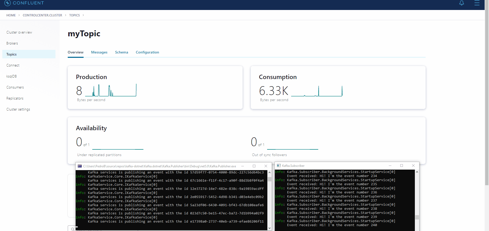

# kafka-dotnet

The purpose of this repository is to explain step by step how to build producer and consumer applications that are interacting using [Confluent Kafka.](https://www.confluent.io/)


## Getting started

- If you don't have the docker installed, please do install it [here.](https://docs.docker.com/compose/install/)

- Let's set the confluent platform to run locally, download this [confluent platform all-in-one docker compose file.](https://github.com/confluentinc/cp-all-in-one/blob/6.1.1-post/cp-all-in-one/docker-compose.yml)

- Then run the following command `docker-compose up -d`. This will start the confluent platform, it might take some minutes.

- Go to http://localhost:9021 and create a topic.

- You are ready! If not, click [here](https://docs.confluent.io/platform/current/quickstart/ce-docker-quickstart.html#ce-docker-quickstart) for more details.


## Confluent Kafka

### Producing a message using the `Confluent Kafka`.

- To instantiate a producer you need a `ProducerConfig`. In this example, we will only define the `BootstrapServers` but you can define the `BatchSize`, `CompressionType`, and many others.
```csharp

ProducerConfig config = new()
{
    BootstrapServers = this.Options.Server
};

```

- Building the `IProducer`. 
```csharp
using IProducer<string, TMessage> producer = new ProducerBuilder<string, TMessage>(config).Build();
```

- Producing a message.
```csharp
string eventId = Guid.NewGuid().ToString();

Message<string, TMessage> @event = new()
{
    Key = eventId,
    Value = msg,
};

await producer.ProduceAsync(topic, @event, cancellationToken).ConfigureAwait(false);
```

### Consuming a message using the `Confluent Kafka`.

- To instantiate a consumer you need a `ConsumerConfig`. In this, example we define the `BootstrapServers`, the `GroupId`, and the `AutoOffsetReset` but you can define many others. The `AutoOffReset` is set to `Earliest` which means that it will automatically reset the offset to the earliest offset.
```csharp
ConsumerConfig config = new()
{
    BootstrapServers = this.Options.Server,
    GroupId = $"{topic}-{Guid.NewGuid()}",
    AutoOffsetReset = AutoOffsetReset.Earliest
};

```

- Building the `IConsumer`. 
```csharp
using IConsumer<string, TMessage> consumer = new ConsumerBuilder<string, TMessage>(config).Build();
```

- Subscribing a topic. 
```csharp
consumer.Subscribe(topic);
```

- Consuming a message.
```csharp
var message = consumer.Consume(cancellationToken);
```


## Kafka service

This is a wrapper around the confluent Kafka implementation, the goal was to simplify!

The `IKafkaService` has two methods:

- ProduceAsync, all the logic above about producing messages to a topic is wrapped within this method.
- ConsumeAsync, all the logic above about consuming messages from a topic is wrapped within this method.

The `KafkaServiceOptions` gather all the necessary configurations for the producer and consumer.

In your application add the service as follows:

```csharp
services.Configure<KafkaServiceOptions>(this.Configuration.GetSection(nameof(KafkaServiceOptions)));

services.AddKafkaService();
```

Set the `KafkaServiceOptions` in your `appsettings` json file as follows:

```json
{
  "KafkaServiceOptions": {
    "Server": "localhost:9092",
    "Topics": [ "myTopic" ]
  }
}
```

## DEMO

### Producing messages using the Kafka service wrapper.

```csharp
try
{
    int count = 1;

    while (!stoppingToken.IsCancellationRequested)
    {
        await this.kafkaService.ProduceAsync($"Hi! I'm the event number {count}", "myTopic", stoppingToken).ConfigureAwait(false);

        count++;
    }
}
catch (Exception ex)
{
    this.Logger.LogError($"Exception: {ex.GetType().FullName} | " + $"Message: {ex.Message}");
}
```


### Consuming messages using the Kafka service wrapper.

```csharp
try
{
    MessageHandlerDelegate<string> handler = this.HandleAsync;

    await this.kafkaService.ConsumeAsync<string>("myTopic", handler, stoppingToken).ConfigureAwait(false);
}
catch (Exception ex)
{
    this.Logger.LogError($"Exception: {ex.GetType().FullName} | " + $"Message: {ex.Message}");
}
```

Notice, that a handler is passed, it's in this method where all the messages will be delivered.

```csharp
private Task HandleAsync(string @event)
{
    this.Logger.LogInformation($"Event received: {@event}");

    return Task.CompletedTask;
}
```

>**Notice that this a demo, there is a lot of aspects that are not covered here.**